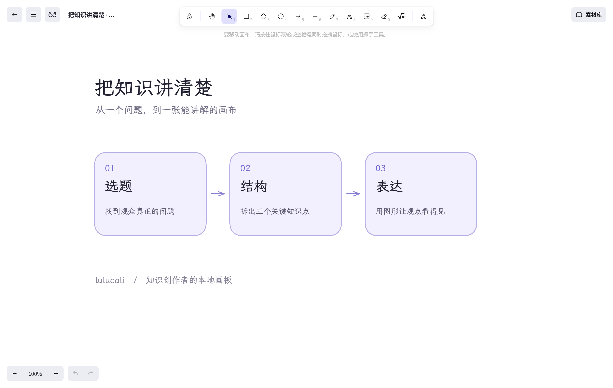

# LuluBoard · 画板

由 **[lulucati](https://github.com/lulucati-lab)** 整理维护，面向自媒体、知识付费、干货分享、短视频编导和 AI 博主的本地讲解画布。

把选题、知识框架和讲解内容画清楚。首次打开是干净的工作区，不预置示例画布或业务文件夹。


## 当前版本

`0.1.0-beta.1`，Windows x64 桌面测试版。使用 Electron 封装，安装后无需 Node.js，无需启动浏览器或本地 Web 服务。macOS、Windows ARM64 和 Linux 尚未提供经过测试的安装包。

**[下载 Windows 测试版](https://github.com/lulucati-lab/LuluBoard/releases/tag/v0.1.0-beta.1)** · **[源代码](https://github.com/lulucati-lab/LuluBoard)**

安装文件：`LuluBoard-0.1.0-beta.1-windows-x64-setup.exe`。公开发布时在本仓库 Releases 附带源码包、安装包、SHA256 校验文件与版本说明。目前安装包没有商业代码签名。

## 为创作者做了什么

- **管理多张画布**：主页、文件夹、缩略图、搜索、排序、重命名、复制、导入、回收站。
- **常用素材**：197 项创作者素材与 8 项基础素材本地可用；拖到指定位置，选中内容可收藏为个人素材，右键删除。
- **干净的演示模式**：眼镜按钮切换，隐藏标题和底部控件，顶部工具栏收起，悬停展开。
- **自动保存**：停笔 2 秒保存，持续编辑每 30 秒保存，关闭桌面窗口前等待保存完成；失败时保留窗口。
- **本地设置**：浅色、深色、跟随系统；选择保存目录，复制并校验后迁移；完整备份与恢复。
- 保留 Excalidraw 的手绘、文字、图片与导出，以及整合的思维导图、时序图、公式能力。



## 安装和使用

1. 运行 Windows x64 安装包，选择安装目录。
2. 从桌面“画板”图标打开。选择“新建画布”开始创作。
3. 回收站上方的“设置”管理主题、保存位置与备份。
4. 设置中的“下载完整备份”生成 `.boardbackup`，换电脑后恢复为副本，不覆盖已有作品。

详细步骤与限制见 [使用指南](docs/USER_GUIDE.md)。

## 保存与隐私

桌面默认工作区在 `%APPDATA%/LuluBoard/boards-data`，与安装目录分离。个人素材同目录保存。迁移设置在默认目录旁的 `boards-data.settings.json`。卸载不主动删除创作数据，升级使用同一工作区。

浏览器开发版本的个人素材仍保存在浏览器中；迁入桌面版，请先从旧版设置导出完整备份，再在桌面版恢复。复制画布文件夹不能代替旧浏览器的素材备份。

核心绘图、主页与内置素材可离线使用。网页嵌入、自定义远程字体、浏览在线素材等外部内容需要联网。构建默认关闭行为统计与 Sentry；应用不提供云同步或账号登录。主动打开外部链接会交给系统浏览器。

## 源码与构建

源代码随对应版本发布。使用 Node.js 22.12+ 和 Yarn 1.22.22，Windows x64：

```powershell
corepack yarn install --frozen-lockfile
npm --prefix desktop ci
node scripts/build-desktop.cjs
npm --prefix desktop run dist
```

输出在 `release/`。`desktop/` 只装 Electron 与打包工具；运行时复用现有 Node 文件存储，不依赖 Vite。发行文件采用白名单，个人数据、`.env.local`、日志及开发依赖不进入安装包。

开发网页：`yarn start`。开发桌面：先构建，再 `npm --prefix desktop start`。网页文件服务仅供本机，不可直接当多用户公网服务部署。

测试：

```powershell
node node_modules/vitest/vitest.mjs run excalidraw-app/boards/server.test.ts --maxWorkers=1 --minWorkers=1
# 安装 Playwright 的开发环境中执行；仅使用临时隔离数据
node scripts/check-desktop.cjs
```

[发布说明](docs/RELEASE.md) · [版本记录](CHANGELOG.md) · [贡献方式](CONTRIBUTING.md)

## 开源来源与署名

本项目是独立衍生版本，不是上游官方客户端。

- [Excalidraw](https://github.com/excalidraw/excalidraw)：原始引擎与编辑器。
- [hulkbig/excalidraw-zh](https://github.com/hulkbig/excalidraw-zh)：采用的中文项目基础。
- [chenxuan520/excalidraw](https://github.com/chenxuan520/excalidraw)：部分扩展功能，整合来源提交 `ea1a81cd`。
- lulucati：本版本创作者定位、主页管理、本地保存与设置、素材交互、演示界面及桌面封装的整理维护。

遵循 [MIT 许可证](LICENSE)，保留原版权声明。第三方素材、字体与依赖使用各自许可证，详见 [资源来源与署名](public/licenses/NOTICE.txt)。本版本品牌与署名不代表第三方代码或素材由 lulucati 独占原创。
